# Architecture

## Overview

FlagRegistry is a public, permissionless on-chain reputation registry on
Arbitrum, paired with a Python backend that watches on-chain activity and
writes flags automatically, and a Telegram bot that surfaces alerts and
lets anyone query an address's flag history on demand.

The core design decision: **flags live on-chain, not in a private
database.** Anyone can flag an address, and anyone (any wallet, dApp, or
bot, not just this one) can read that history. The backend and bot are
just one client of the registry, not the source of truth.

## Diagram

```mermaid
flowchart TD
    subgraph Arbitrum["Arbitrum Sepolia"]
        FR["FlagRegistry.sol<br/>(deployed & verified)"]
    end

    subgraph Backend["Python Backend"]
        CM["chain_monitor.py<br/>polls watched addresses<br/>every 30s"]
        FW["flag_writer.py<br/>calls flag&#40;&#41; on detection"]
        CM -->|"large outflow<br/>detected"| FW
    end

    subgraph Bot["Telegram Bot"]
        TB["telegram_bot.py"]
        User(["Hackathon judge /<br/>any user"])
    end

    Arbitrum -->|"eth_getBlock,<br/>eth_getBalance<br/>(read)"| CM
    FW -->|"flag&#40;target, reason,<br/>severity&#41; tx"| FR
    FR -->|"AddressFlagged<br/>event"| FW
    FW --> TB
    TB -->|"🚩 automatic alert"| User
    User -->|"/status &lt;address&gt;"| TB
    TB -->|"getFlags&#40;address&#41;<br/>(read)"| FR
    FR -->|"flag history"| TB
    TB -->|"formatted reply"| User

    OtherApps(["Any other dApp,<br/>wallet, or bot"])
    OtherApps -.->|"can also read<br/>getFlags&#40;&#41; directly"| FR
```

## Components

| Component | Role |
|---|---|
| `contracts/FlagRegistry.sol` | On-chain registry. Anyone can `flag()` an address; flags are permanent and append-only. Anyone can read `getFlags()`, independent of this project's bot. |
| `backend/chain_monitor.py` | Polls a fixed list of watched addresses on a timer, detects large outflows (a single tx moving a large fraction of a wallet's balance). |
| `backend/flag_writer.py` | Takes a detected event and writes it to `FlagRegistry` as an on-chain flag, using a dedicated backend wallet. |
| `backend/telegram_bot.py` | Two jobs: pushes an alert when a new flag is written, and answers `/status <address>` queries by reading `getFlags()` live from the contract. |
| `backend/main.py` | Runs the polling loop and the bot together. |

## Why this shape

- **Detection is off-chain, truth is on-chain.** Computing "is this a large
  outflow" doesn't need to happen on-chain, it's cheaper and simpler in
  Python. But the *result* (the flag itself) is written on-chain, so it's
  not locked inside this bot's database. Any other tool can independently
  verify or build on that history.
- **Polling, not websockets.** Simpler, easier to debug under a hackathon
  deadline, and no different from the judges' perspective, they see the
  same alert either way.
- **One clear detection rule to start** (large outflow), rather than many
  half-built ones, so the system is fully working end-to-end rather than
  broad and fragile.
